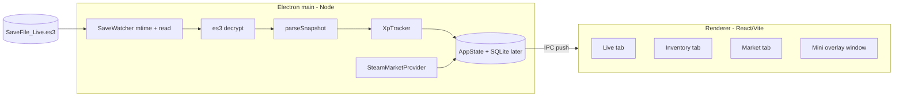

# Architecture

Single-language TypeScript app: an Electron desktop shell hosting a React/Vite
UI. All save-decryption and tracking logic lives in a framework-free `core/`
that is unit-tested independently.

## Processes

## Boundaries

- **main** owns all file system access, decryption, network (Steam), and the
  tracker state. It is the only place secrets/paths are touched.
- **preload** exposes a narrow, typed `window.tbh` API via `contextBridge`
  (e.g. `onStats(cb)`, `reset()`, `getInventory()`). No direct Node access leaks
  into the renderer.
- **renderer** is pure React UI. It subscribes to pushed stats via `TbhProvider`
  (single IPC listener per channel) and renders.
- **core** (`es3`, `save/snapshot`, `tracker`, `stages`, `heroes`, `gamedata`,
  `inventory/*`) has no Electron/React imports so it can be unit-tested with Vitest.

No local HTTP server: main <-> renderer communicate over Electron IPC, which
removes the FastAPI/WebSocket bridge that a Python backend would have needed.

## Windows

Two `BrowserWindow`s load the same Vite bundle on different routes:

- **Full companion window** - resizable, tabbed (Live / Inventory / Market).
- **Mini overlay** (`/overlay`) - frameless, always-on-top, draggable, compact;
  toggled from the tray / full window.

## Data flow (live stats)

1. `SaveWatcher` notices `SaveFile_Live.es3` mtime changed (debounced).
2. Reads bytes (with a short retry for mid-write sharing violations).
3. `es3.decrypt` -> `parseSnapshot` -> `SaveSnapshot`.
4. `XpTracker.update(snap)` computes XP/gold/per-hero rates (positive deltas
   only, rates keyed on mtime, held constant between changes) and appends to
   history on change.
5. main pushes a `Stats` payload to the renderer over IPC; the UI updates.
